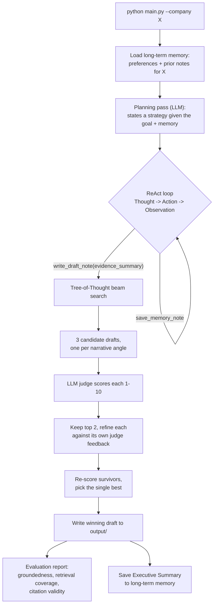

# Research Note Drafting Agent

CMU Agentic AI Capstone project: an agent that turns scattered source
documents (meeting notes, agendas, pitch books, prior research) into a
structured draft research note for a research analyst.

## Quickstart

The fastest path from a clean checkout to a generated draft note:

```bash
git clone https://github.com/saravanag78/capstone-research-agent.git
cd capstone-research-agent

python3 -m venv .venv
source .venv/bin/activate
pip install -r requirements.txt

cp .env.example .env
# open .env and paste in real values for ANTHROPIC_API_KEY and VOYAGE_API_KEY
# (see "Setup" below for where to get each key)

python main.py --company "ABC Company"
```

That last command is the whole pipeline end to end: planning, the ReAct
tool loop, RAG retrieval, memory, Tree-of-Thought drafting, and evaluation
(see [How It Works](#how-it-works)). It prints its progress to the
terminal as it goes — you'll see, in order:

```
=== Long-Term Memory ===       <- preferences/notes from prior runs, if any
=== Plan ===                    <- the strategy the model states up front
--- Step 1: Thought ---         <- reasoning before each tool call
--- Step 1: Action ---          <- which tool was called, with what arguments
--- Step 1: Observation ---     <- the tool's result
...                              (repeats until the agent is ready to draft)
=== Tree of Thought: generating 3 candidate narratives ===
=== Tree of Thought: refining 2 surviving branch(es) ===
=== Short-Term Memory (this session) ===
=== Evaluation ===               <- groundedness, retrieval coverage, citation check
=== Final Result ===
```

The finished draft is saved to `output/draft_note_<company>_<date>.md` —
that's the one artifact worth opening if you only look at one thing.

A full run takes noticeably longer and costs more than a single API call
(roughly 10 extra Claude calls for the Tree-of-Thought search, on top of
the ReAct loop itself) — expect it to run for a minute or two, not seconds.

## The Problem

Before writing a research note, an analyst has to read through multiple
disconnected documents — meeting notes, agendas, pitch decks, their own
prior write-ups — pull out what changed, cross-check numbers across
sources, and organize all of it into a consistent structure. That's slow,
repetitive, and easy to get subtly wrong (missing a contradiction between
two sources, forgetting what was flagged last time). This project builds
an agent that does that synthesis step: given a company name, it gathers
the relevant evidence itself, drafts a note under a fixed analyst-ready
structure, and is explicit about what it doesn't know or couldn't verify,
rather than silently guessing.

The project was built incrementally, each stage adding a capability on top
of the last (see [Reviewing the Project](#reviewing-the-project) for how
these map to the course's weekly deliverables):

1. Draft from documents in one linear pass.
2. Turn that into an agent that plans, decides what to look at, and acts
   through tools (ReAct).
3. Replace whole-file reads with real semantic retrieval (RAG).
4. Give the agent memory across runs, not just within one.
5. Replace single-shot drafting with a scored, multi-candidate search
   (Tree of Thoughts).
6. Make the whole pipeline evaluate itself and fail gracefully.

## How It Works



**Planning & orchestration.** Each run starts with a planning call: the
model states a short strategy for gathering evidence, informed by whatever
long-term memory already exists for that company. `agent.py`'s
`ReActAgent` then drives the actual loop.

**ReAct loop (Thought → Action → Observation).** On each turn the model
reasons in plain text (the *Thought*), then calls exactly one tool (the
*Action*); the tool's result is fed back as the *Observation* for the next
turn. This continues until the model decides it has enough evidence and
calls `write_draft_note`. Tools are a small abstraction layer
(`tools.py`) — each one pairs a JSON schema the model calls against with a
plain Python function:

| Tool | Purpose |
|---|---|
| `list_documents` | See what source documents exist |
| `read_document` | Read one document's full text by filename |
| `semantic_search` | RAG: retrieve the top-k chunks most relevant to a query |
| `save_memory_note` | Persist a fact to long-term memory, beyond this run |
| `write_draft_note` | Signal "ready to draft" with an evidence synthesis |

Any tool failure (a bad argument, a network error) is caught and returned
as an observation the agent can react to, instead of crashing the run.

**Retrieval (RAG).** Rather than dumping whole files into the prompt,
documents are chunked into overlapping 60-word windows (`chunker.py`),
embedded with Voyage AI (`embeddings.py`), and held in an in-memory
cosine-similarity vector store (`vector_store.py`). `semantic_search`
retrieves only the top-k chunks relevant to each query the agent asks —
bounded per query regardless of how large `data/` grows, unlike reading
whole files.

**Memory.** Short-term memory (`memory.py`) is a per-run scratchpad of
every Thought/Action, discarded when the run ends. Long-term memory
persists across runs in `memory/agent_memory.json`: analyst preferences
(set via `--remember`, applied to every future run) and per-company notes
(an Executive Summary excerpt saved automatically after each draft, or a
specific fact the agent chooses to save via `save_memory_note`). Both are
loaded at the start of every run and injected into the planning and system
prompts, so a second run for the same company already knows what the
first one found.

**Tree-of-Thought drafting.** When the agent calls `write_draft_note`, it
hands off a short evidence synthesis — not a full note — to a beam search
(`tree_of_thought.py`): 3 candidate drafts are generated under fixed,
distinct narrative angles (growth, risk, execution/credibility), each
scored 1–10 by an LLM judge on groundedness/coverage/clarity, the top 2
survive, each is refined once against its own judge feedback, and the
single best-scoring refinement is written to disk.

**Evaluation.** After drafting, `evaluation.py` reports: the winning
candidate's groundedness score (reusing the Tree-of-Thought judge, no
extra call), what fraction of the available documents were actually
retrieved this session, and a cross-check of every filename cited in
"Source Attribution" against what actually exists in `data/` — flagging
any the model invented. This is diagnostic output only; it doesn't block a
draft from being saved.

## Setup

```bash
python3 -m venv .venv
source .venv/bin/activate
pip install -r requirements.txt
cp .env.example .env  # then fill in ANTHROPIC_API_KEY and VOYAGE_API_KEY
export $(cat .env | xargs)  # or use direnv/python-dotenv
```

You need two API keys:
- **Anthropic** (`ANTHROPIC_API_KEY`) — get one at [console.anthropic.com](https://console.anthropic.com).
- **Voyage AI** (`VOYAGE_API_KEY`) — used for embeddings, since Anthropic
  doesn't serve those directly; get one at [dash.voyageai.com](https://dash.voyageai.com)
  (free tier available). Use the key starting with `pa-` from the **API
  Keys** page, not a project ID.

## Usage

```bash
# Run the full agent (planning + ReAct + RAG + memory + Tree of Thoughts + evaluation)
python main.py --company "ABC Company"

# Run the Week 1 baseline instead — a single linear load -> prompt -> generate pass
python main.py --company "ABC Company" --mode linear

# Save a standing analyst preference (applies to this and every future run)
python main.py --remember "always lead with the biggest guidance change"

# Save a preference and run in the same command
python main.py --remember "always flag regulatory risk first" --company "ABC Company"

# Inspect stored long-term memory (no API calls)
python main.py --show-memory
```

The agent prints its long-term memory, plan, each Thought/Action/Observation
step, the Tree-of-Thought candidate/scoring trace, and the final evaluation
report to stdout. The winning draft is saved under `output/` as
`draft_note_<company>_<date>.md`.

A full agent run costs noticeably more than the Week 1 baseline — expect
roughly 10 extra Claude calls for the Tree-of-Thought search on top of the
ReAct loop itself.

### Web UI

For a research analyst who'd rather not use the command line:

```bash
streamlit run app.py
```

This opens a local web page (`app.py`) with a company-name field and a
"Generate Draft Research Note" button. It's a UI over the same
`ReActAgent`/`run_linear` functions the CLI calls — there's no separate
API server, since the only client is a human clicking a button in the same
process. The sidebar shows and lets you add long-term memory preferences,
the run log streams live as the agent works, and the finished draft is
shown as rendered Markdown with a download button.

## Project Structure

```
capstone-research-agent/
├── app.py                        # Streamlit web UI: streamlit run app.py
├── main.py                      # CLI entry point: --mode agent (default) or linear; --remember; --show-memory
├── agent.py                     # planning + ReAct loop; memory, Tree-of-Thought handoff, evaluation
├── tools.py                     # tool abstraction layer; catches and recovers from tool failures
├── rag.py                       # chunk -> embed -> index -> retrieve pipeline
├── chunker.py                   # splits documents into overlapping word-window chunks
├── embeddings.py                 # Voyage AI embeddings client
├── vector_store.py               # in-memory cosine-similarity vector database
├── memory.py                     # short-term scratchpad + long-term JSON-backed memory
├── tree_of_thought.py            # candidate generation, LLM-judge scoring, beam search
├── evaluation.py                  # groundedness/retrieval-coverage/citation-validity report
├── document_loader.py            # loads sample source docs from data/
├── prompt_builder.py             # Week 1 baseline: fills prompts/draft_note_prompt.txt
├── llm_client.py                  # Week 1 baseline: single-shot Anthropic Messages API call
├── prompts/
│   ├── draft_note_prompt.txt      # Week 1 baseline structured note template
│   ├── agent_system_prompt.txt    # ReAct system prompt
│   ├── planning_prompt.txt        # planning-step prompt
│   ├── tot_generate_prompt.txt    # initial candidate drafting, one per narrative angle
│   ├── tot_refine_prompt.txt      # refines a surviving candidate against judge feedback
│   └── tot_score_prompt.txt       # LLM-judge scoring rubric
├── data/
│   ├── agendas/
│   ├── meeting_notes/
│   ├── pitch_books/
│   └── prior_notes/               # sample source documents
├── memory/
│   └── agent_memory.json          # generated; long-term memory store (gitignored)
└── output/                        # generated draft notes land here (gitignored)
```

## Design Notes & Limitations

- Uses `claude-sonnet-5` by default (override with the `LLM_MODEL` env var,
  e.g. `claude-opus-5` for higher-quality drafts at higher cost). Embeddings
  use `voyage-3.5` by default (override with `VOYAGE_EMBED_MODEL`).
- The vector index is rebuilt in memory on every run — fine at this data
  scale, but every run re-embeds all chunks; nothing is persisted to disk.
- The ReAct loop caps at `MAX_STEPS = 8` (`agent.py`). If that's reached
  without the agent choosing to draft, it forces a best-effort draft from
  whatever evidence was gathered, clearly labeled as such, instead of
  crashing.
- Long-term memory is a single flat JSON file, not a database — fine at
  this scale, but `add_preference`/`add_note` rewrite the whole file on
  every call, so it isn't safe for concurrent runs.
- Short-term memory never touches disk; nothing carries over between runs
  except what gets promoted into long-term memory (an automatic Executive
  Summary excerpt, or an explicit `save_memory_note` call).
- Tree-of-Thought's cost is bounded, not proportional to corpus size:
  `NARRATIVE_ANGLES` and `BEAM_WIDTH` in `tree_of_thought.py` are fixed
  regardless of how much source material exists.
- The evaluation report is diagnostic only — printed to stdout, not written
  into the saved `.md` file, and it doesn't block a draft from being saved
  even when it flags invalid citations.

## Reviewing the Project

If you're reviewing this against the weekly deliverables rather than just
running it, a single `python main.py --company "ABC Company"` exercises nearly
everything — the table below says which part of that one run's terminal
output, and which file, corresponds to each week. Each run costs a live
API call (see [Design Notes & Limitations](#design-notes--limitations)),
so if you'd rather not run it yourself, reading the referenced file plus
the "look for" column is enough to verify the deliverable without
executing anything.

| Week | Deliverable | Read this file | Look for this in a run |
|---|---|---|---|
| 1 | Simple drafting agent (linear baseline) | `prompt_builder.py`, `llm_client.py` | Run with `--mode linear`: one prompt is built from all documents and sent in a single Claude call — no `Thought`/`Action` steps at all |
| 2 | Agent architecture & ReAct | `agent.py` (`ReActAgent.run`), `tools.py` | The `--- Step N: Thought/Action/Observation ---` blocks; each step is exactly one tool call |
| 3 | RAG integration | `chunker.py`, `embeddings.py`, `vector_store.py`, `rag.py` | A `semantic_search` Action/Observation pair shows chunks tagged `[filename chunk N, similarity=0.xxx]`, not whole files |
| 4 | Memory implementation | `memory.py` | The `=== Long-Term Memory ===` block at the very start of a run; run twice for the same `--company` and the second run's plan references the first run's Executive Summary. Also try `python main.py --show-memory` |
| 5 | Tree of Thoughts | `tree_of_thought.py` | The `=== Tree of Thought: generating 3 candidate narratives ===` / `refining 2 surviving branch(es)` blocks, each candidate line prefixed with its judge score `[N.N]` |
| 6 | Refinement & evaluation | `evaluation.py`, `Tool.run()` in `tools.py`, the `MAX_STEPS` fallback in `agent.py` | The `=== Evaluation ===` block at the end of a run (groundedness score, retrieval coverage, citation check); to see the failure handling itself, temporarily unset `ANTHROPIC_API_KEY` and confirm `main.py` prints a clean "Agent run failed" message instead of a raw traceback |

For a narrower look at just one week's code, each is also self-contained
enough to read on its own — none of `chunker.py`, `vector_store.py`,
`memory.py`, `tree_of_thought.py`, or `evaluation.py` depend on each other
except through the shared `Document`/`Chunk` dataclasses.
